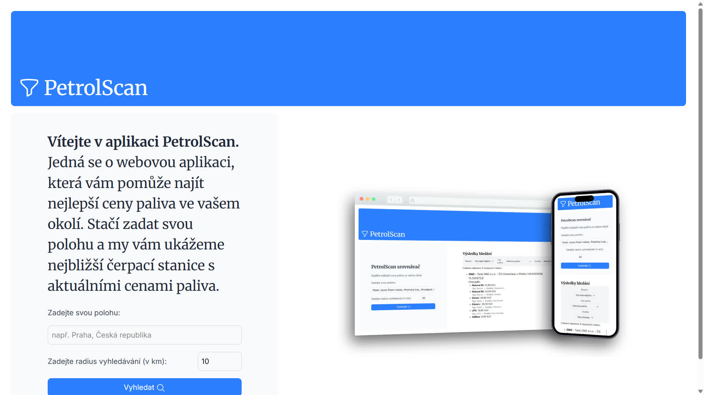
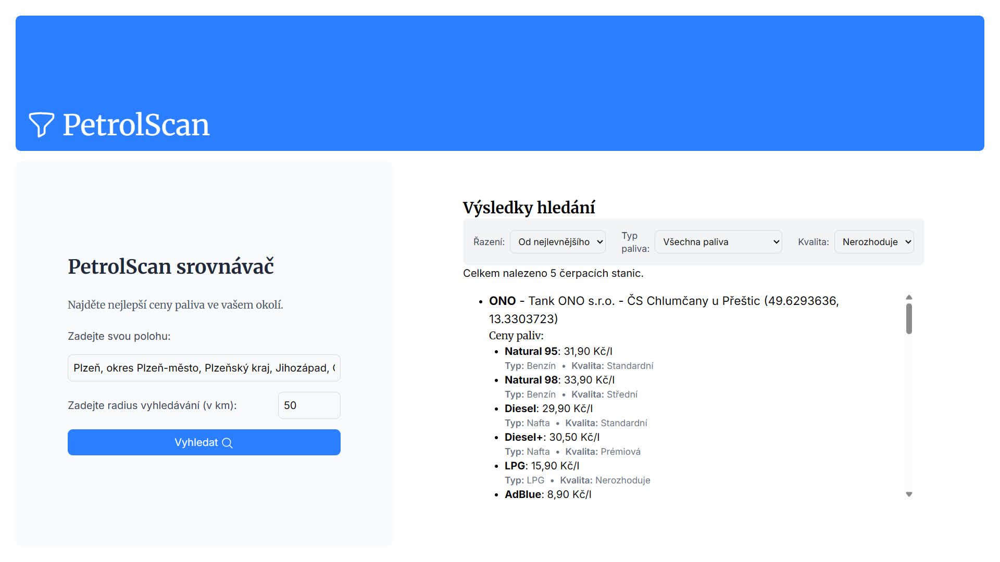

# PetrolScan Web Application

This web application is part of my Bachelor Thesis assignment
([available here](https://github.com/POL0423/BachelorThesis)).

I created it as a [Next.js](https://nextjs.org) project bootstrapped with
[`create-next-app`](https://nextjs.org/docs/app/api-reference/cli/create-next-app).

## Features

This web application consists of two parts:

1. [Home page](#home-page)
2. [Search results](#search-results)

### Home page

The home page is the entry point to the application. It contains a splash image
that showcases how the website looks like on PC in the browser, and in a phone.
On the left side, you can see the search form, where you enter your location
and the search radius. Search form contains an autocomplete listener that displays
the full location suggestions, based on your input. Autocomplete uses the
[OpenStreetMap Nominatim API](https://nominatim.openstreetmap.org/) which makes it
possible to search up OpenStreetMap data. API query requests data in JSON format,
and looks mainly for the list of suggested locations.

### Search results

Once you have submitted your search query, couple of things happen. First, your
location search contacts OSM API to retrieve the GPS location of that specific
location. If multiple locations are available, the first result is used.
That GPS location is then used for database query and filtered based on the
spherical distance of the specified points and filters settings (fuel type
and quality), sorted by the price ascending or descending (depending on sort
settings). Default sorting option is ascending, and no fuel quality and type
is being filtered. Filters and sorting options are available at the top of the
search results. These options finetune the database query.

Remember the GPS coordinates retrieved for filtering based on the spherical
distance? What MySQL uses is something called Haversine Formula. This formula
is embedded to the search results page as well and computes the spherical
distance of the reference GPS location to the petrol station GPS location.

Finally, the search results contain following parts:

- List of petrol stations in the vicinity. Each item contains these parts:
  - Petrol station name and address
  - List of fuels at this petrol station (if filtered, contains only those
    selected ). Each fuel is described by these parts:
    - Fuel name and price in CZK
    - Fuel type and quality
  - The distane to this petrol station relative to the reference GPS coordinates
  - Last update date.
- Scrollbar if the list is longer.

## Language

Programming langage used is TypeScript. The website language is in Czech
language, since the Bachelor Thesis is written in Czech language.

## GitHub Copilot?

The use of GitHub Copilot for this part was minimal, only for troubleshooting.
For example the autocomplete section was AI-assisted, to fix it not being
able to work.
